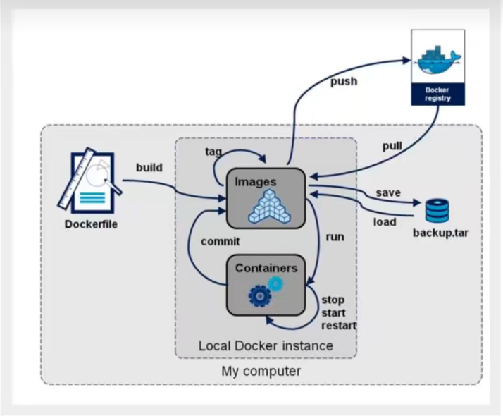

# Docker概述
## Docker的历史
2010，美国人创建了dotCloud
2013，Docker开源
2014，Dcoker1.0发布
Docker优点：
1.虚拟机笨重，Docker容器技术轻巧，但也是虚拟化技术
## 聊聊Docker
Docker基于Go语言开发的
官网：https://www.docker.com/
文档地址：https://docs.docker.com/
仓库地址：https://hub.docker.com/
## Docker和虚拟机的不同
传统虚拟机，虚拟出一条硬件，运行一个完整的操作系统，然后在这个系统上安装和运行软件；
容器内的应用直接运行在宿主机的内容，容器是没有自己的内核的，也没有虚拟机的硬件。
## DevOps(开发运维)
更快速的交付和部署
更便捷的升级和扩容
更简单的运维
更高效的计算资源利用
# Docker安装
## Docker的基本组成

### 镜像（image）：
docker镜像就好比一个模板，可以通过这个模板来创建容器服务，tomcat镜像===>run===>tomcat01容器（提供服务器），通过这个镜像可以创建多个容器。
### 容器（container）：
Docker利用容器技术，独立运行一个或者一个组应用，通过镜像来创建
目的就可以把这个容器理解为一个简易的linux
### 仓库(repository)：
仓库就是存放镜像的地方
仓库分为私有和公有的
Docker Hub默认是国外的
阿里云...都有容器服务器（配置镜像加速）
## 安装Docker
查看linux系统的内核：
4.15.0-169-generic
查看系统的版本：
cat /etc/os-release

查看官方文档：一步一步的安装

systemctl restart docker

查看是否安装成功： sudo docker version  

验证是否成功运行：sudo docker run hello-world

查看镜像列表：sudo docker images

docker默认工作路径：/var/lib/docker 
## 测试命令
```
docker version
docker run hello-world
```
#卸载
`查看官网`

## 配置阿里云镜像加速
去阿里云找容器镜像服务
```
sudo mkdir -p /etc/docker

sudo tee /etc/docker/daemon.json <<-'EOF'
{
  "registry-mirrors": ["https://v9gy47ph.mirror.aliyuncs.com"]
}
EOF

sudo systemctl daemon-reload

sudo systemctl restart docker
```
## 回顾run--->HelloWorld工作流程流程

## 底层原理
docker是一个client、server结构的系统，docker的守护进程运行在主机上，通过socket从客户端访问

### docker为什么比vm快
1.docker有着比虚拟机更少的抽象层

2.docker利用的是宿主机的内核，vm需要时guest os


所以说，新建一个容器的时候，docker不需要像虚拟机一样重新加载一个操作系统内核，避免引导。虚拟机时加载guest os，分钟级别；而docker是利用宿主机的操作系统，省略了这个复杂的过程，秒级！

# Docker命令
## 帮助命令
docker version     显示docker的版本信息
docker info        显示docker的系统信息，包括镜像和容器的数量
docker  命令 --help     万能命令

帮助文档的地址：
https://docs.docker.com/engine/reference/commandline/docker/

or  菜鸟教程
## 镜像命令
### 1.docker images    查看所有本地的主机上的镜像

REPOSITORY   镜像的仓库源
TAG          镜像的标签
IMAGE ID     镜像的id
CREATED      镜像的创建时间
SIZE         镜像的大小

-a, --all             Show all images (default hides intermediate images)
-q, --quiet           Only show image IDs

### 2.docker search mysql    搜索镜像

--filter=STARS=3000  搜素出来的镜像就是STARS大于3000的 

### 3.docker pull mysql  下载镜像[:tag]

docker pull mysql:5.7
Using default tag: latest             如果不写tag，默认就是latest
latest: Pulling from library/mysql
72a69066d2fe: Pull complete            分层下载，docker image的核心  联合文件系统    
93619dbc5b36: Pull complete 
99da31dd6142: Pull complete 
626033c43d70: Pull complete 
37d5d7efb64e: Pull complete 
ac563158d721: Pull complete 
d2ba16033dad: Pull complete 
688ba7d5c01a: Pull complete 
00e060b6d11d: Pull complete 
1c04857f594f: Pull complete 
4d7cfa90e6ea: Pull complete 
e0431212d27d: Pull complete 
Digest: sha256:e9027fe4d91c0153429607251656806cc784e914937271037f7738bd5b8e7709  签名
Status: Downloaded newer image for mysql:latest
docker.io/library/mysql:latest   真实地址  

docker pull mysql  等价于 docker pull docker.io/library/mysql:latest 

### 4.docker rmi -f c20987f18b13  根据image id 删除指定镜像

docker rmi -f 容器id 容器id 容器id   删除多个镜像

docker rmi -f $(docker images -aq)   删除全部的镜像

## 容器命令 
说明：我们有了镜像才可以创建容器，linux，下载一个centos的镜像来测试学习
docker pull centos

### 新建容器并启动
docker run [可选参数] image

参数说明

--name='Name'  容器名字  tomcat01  tomcat02 ，用来区分容器
-d             后台方式运行
-it            使用交互方式运行，进入容器查看内容
-p             指定容器的端口 -p 8080：8080
      -p  ip：主机端口：容器端口
      -p  主机端口：容器端口（常用）
      -p  容器端口
      容器端口
-p             随机指定端口

端口暴露

启动并进入容器

maohui@aliyun ~ % sudo docker run -it centos /bin/bash

[root@73221917df46 /]# ls  #查看容器内的centos，基础版本，很多命令都是不完善的！

bin  dev  etc  home  lib  lib64  lost+found  media  mnt  opt  proc  root  run  sbin  srv  sys  tmp  usr  var

从容器中退回到主机
[root@73221917df46 /]# exit

exit

maohui@aliyun ~ % ls                      
                                                                          
1.C语言  a.out  c121.c  c122.c  c123.c  c124.c  install_zsh.sh
### 列出所有的运行的容器 
docker ps

-     列出当前正在运行的容器
-a    列出当前正在运行的容器+带出历史运行过的容器
-n=?  显示最近创建的容器（1）
-q    只显示容器的编号

### 退出容器
exit  直接容器停止并退出

ctrl+p+q  容器不停止退出
### 删除容器
docker rm 容器id               删除指定的容器

docker rm -f $(docker ps -aq)  删除所有的容器

docker ps -a -q |xargs docker rm 删除所有的容器
### 启动和停止容器的操作
docker start 容器id       启动容器

docker restart 容器id     重启容器

docker stop 容器id       停止当前正在运行的容器

docker kill 容器id        强制停止当前容器
## 常用其他命令
### 后台启动容器
maohui@aliyun ~ % sudo docker run -d  centos                                 9c9942e2567d7fc4fad09d4dc7d95da477150ccd0e817236c79dd8c82d1609c3

maohui@aliyun ~ % sudo docker ps                                                                               
CONTAINER ID   IMAGE     COMMAND   CREATED   STATUS    PORTS     NAMES

！！！！常见的坑：docker容器使用后台运行，就必须要有一个前台进程，docker发现没有应用，就会自动停止；nginx，容器启动后，发现自己没有提供服务，就会立刻停止，就是没有程序了。
### 查看日志
docker  logs 

-tf   显示日志
--tail number  显示日志的条数

docker logs -tf --tail 10 容器id

如果容器中没有日志，自己编写一段shell脚本
docker run -d centos /bin/sh -c "while true;do echo maohui;sleep 1;done"
### 查看容器中进程信息
docker top 容器id 
### 查看容器的元数据
sudo docker inspect bf93dbb3efca

### 进入当前正在运行的容器
我们通常容器都是使用后台方式运行的，需要进入容器，修改一些配置

docker exec -it 容器id /bin/bash（进入容器后开启一个新的终端，可以在里面操作）

docker attach 容器id（进入容器正在执行的终端，不会启动新的进程）

### 从容器内拷贝文件到主机上
docker cp 容器id：容器内路径  目的主机路径

拷贝是一个一个手动过程，未来我们使用卷的技术 -v卷的技术

# work practice
## docker运行部署nginx
1.搜索镜像 docker search nginx

2.下载最新镜像  docker pull nginx

3.运行
sudo docker run -d --name nginx01 -p 3344:80 nginx 

-d      后台方式运行
--name  给容器命名
-p      宿主机端口，容器内部端口
4.测试
本机自测试：curl localhost:3344 

公网测试：阿里云服务器-》安全组-》开启端口3344-》访问服务器ip+3344

5.进入nginx容器:sudo docker exec -it nginx01 /bin/bash-->whereis nginx-->

6.停止nginx：exit退出--》docker stop 容器id

## docker运行部署tomcat
官方的使用：docker run -it --rm tomcat:9.0 这种方法一般用来测试，容器用完就删掉了，但是镜像没有删。

1.下载：
docker pull tomcat

2.启动：
sudo docker run -d -p 3355:8080 --name tomcat01 tomcat 

配置阿里云安全组后，直接访问：404

3.进入容器:
sudo docker exec -it tomcat01 /bin/bash

发现问题1.linux命令少了；3.webapps下没有。阿里云镜像的原因，默认是最小的镜像，所有不必要的都删除掉。保证最小的可运行的环境

解决办法：cp -r ./webapps.dist/* ./webapps

## 部署ES+kibana
es暴露的端口很多！！es十分的耗内存！！ es的数据一般需要放置在安全目录！挂载 

1.启动elasticsearch：docker -d --name elasticsearch -p 9200:9200 -p 9300:9300 -e "discovery.type=single-node" elasticsearch:7.6.2

启动了 linux就卡住了 docker stats 查看cpu的状态

赶紧关掉es容器 docker stop 容器id--》增加内存限制，修改配置文件 -e 环境配置修改--》docker -d --name elasticsearch01 -p 9200:9200 -p 9300:9300 -e "discovery.type=single-node"  -e ES_JAVA_OPTS="Xms64m -Xmx512m" elasticsearch:7.6.2


# Commit镜像
docker commit 提交容器成为一个新的版本

docker commit -m="提交的描述信息" -a="作者" 容器id 目标镜像名 [tag]

docker commit -a="maohui" -m="add webapps app" 79c5446bf77d tomcat02:1.0

查看docker images 就可以看到一个新的镜像为tomcat02：1.0

# 容器数据卷
数据可以持续化；mysql的数据可以存储在本地；docker容器中产生的数据，同步到本地！
目录的挂载，将容器内的目录，挂载到linux上！


## 方式一：直接使用命令来挂载 -v
docker run -it -v 主机目录:容器目录

docker run -it -v /home/ceshi:/home centos /bin/bash

dcoker inspect 容器id 查看容器详细信息

会同步增删改查，容器没了，但是本地数据不会没有。
### mysql同步数据
1.运行容器：需要做数据挂载！ #安装启动mysql，需要配置密码的；看hub.docker.com的文档

docker run -d -p 3310:3306 -v /home/mysql/conf:/etc/mysql/conf.d -v /home/mysql/data:/var/lib/mysql -e MYSQL_ROOT_PASSWORD=123456 --name mysql01 mysql 

2.启动后使用navicat测试连接（注意打开安全组）
navicat 连接到服务器的3310 ---3310和容器内的3306映射

将我们的容器删除，挂载在本地的数据卷依旧没有丢失，实现了容器数据持久化功能。
### 具名和匿名挂载
匿名挂载
-v 容器内路径!
docker run -d -P --name nginx01 -v /etc/nginx nginx 

查看所有的volume的情况：docker volume ls。
匿名挂载就是-v后面只写了容器内的路径，没有写容器外的路径

具名挂载！！！！！！！！

docker run -d -P --name nginx02 -v jumping-nginx:/etc/nginx nginx

所有的docker容器内的卷，没有指定目录情况下都是在：/var/lib/docker/volumes/xxxx/_data


-v  /宿主机路径：/容器内路径  #指定路径挂载

拓展：

通过-v容器内路径：ro  rw改变读写权限
ro只读；
rw读写

## 方式二：初始dockerfile
dockerfile就是用来构建docker镜像的构建文件！

1.创建一个dockerfile文件，名字可以随机 建议dockerfile；文件中的内容 指令（大写） 参数。

FROM centos

VOLUEME ["volume01","volume02"]

CMD echo "----end-----"
CMD /bin/bash


2.启动自己的镜像

docker run -it bac13cd6679b /bin/bash

bin  dev  etc  home  lib  lib64  lost+found  media  mnt  opt  proc  root  run  sbin  srv  sys  tmp  usr  var  volume01	volume02

后面两个目录就是生成镜像的时候自动挂载的，数据卷目录

3.查看宿主机的挂载路径

首先随便在volume01中新建一个文件，然后退出到宿主机，查看容器id，docker inspect 容器id 查看”mounts“

4.查看文件是否同步

cd ”mounts“中的路径；查看是的同步文件

### 数据卷容器
容器与容器之间共享数据


docker run -it --name docker02 --volumes-from docker01 centos


son --volume-from father(只备份容器的数据卷，任何容器没有，都不影响另外的容器数据)

# DockerFile
1.编写一个dockerfile文件

2.Docker build构建成为一个镜像

3.docker run 运行镜像

4.docker push 发布镜像（dockerhub/阿里云镜像仓库）
## 基础知识：
1.每个保留关键字(指令)都是必须大写字母
2.执行从上到下顺序执行
3.#表示注释
4.每一个指令都会创建提交一个新的镜像层，并提交

- dockerfile:构建文件，定义了一切的步骤，源代码
- dockersimages：通过dockerfile构建生成的镜像，最终发布和运行的产品
- docker容器：容器就是镜像运行起来提供服务器
## dockerfile的指令
```bash
FROM             #基础镜像，一切从这里开始
MAINTAINER       #镜像是谁写的，姓名—+邮件
RUN              #镜像构建的时候需要运行的命令
ADD              #步骤，这个tomcat压缩包！添加内容
WORKDIR          #镜像的工作目录
VOLUME           #挂载的目录
EXPOSE           #指定暴露端口配置 等于-P
CMD              #指定这个容器启动的时候要运行的命令，只有最后一个会生效，可被替代
ENTRYPOINT       #指定这个容器启动的时候要运行的命令，可以追加命令
ONBUILD          #当构建一个被继承dockerfile  这个时候就会运行ONBUILD的指令，触发指令
COPY             #类似add，将我们的文件拷贝到镜像中
ENV              #构建的时候设置环境变量
```

## 实战：自己的centos
1.编写一个dockerfile文件
```bash
root@aliyun:/home/dockerfile# cat dockerfile-centos 
FROM centos:7
MAINTAINER maohui<409788696@qq.com>

ENV MYPATH /usr/local
WORKDIR   $MYPATH

RUN yum -y install vim
RUN yum -y install net-tools

EXPOSE 80

CMD echo $MYPATH
CMD echo "-------end------"
CMD /bin/bash

````
2. 通过这个文件构建镜像
命令 dokcer build -f dockerfile文件路径 -t 镜像名：[tag]
```
docker build -f dockerfile-centos -t mycentos:0.1 .
```
3. 测试运行
起始工作路径变为/usr/local

## CMD和ENTRYPOINT的区别
- cmd 
1. 构建一个dockerfile其中cmd命令为CMD ["ls","-a"]
2. build这个dockerfile，别忘了后面的点
3. run新建的image后面加-l，显示错误，因为不能叠加为ls -al，只会覆盖；需要加为ls -al，
- ENTRYPOINT
而entrypoint可以叠加，不会覆盖。
## 实战：tomcat镜像


## 发布自己的镜像(Dockerhub)
1. Dockerhub，注册自己的张海,https://hub.docker.com/
2. 确定可以登录
3. 登录
```bash
root@aliyun:/home/dockerfile# docker login -u maowansen
Password: 
WARNING! Your password will be stored unencrypted in /root/.docker/config.json.
Configure a credential helper to remove this warning. See
https://docs.docker.com/engine/reference/commandline/login/#credentials-store

Login Succeeded

```
4. 新建一个新标签镜像，带用户名
```
docker tag a7d16844cab7 maowansen/mycentos:1.0
```
5. 
```
docker push maowansen/mycentos:1.0
```
## 发布镜像（阿里云）
1. 登录阿里云
2. 找到容器镜像服务
3. 创建命名空间

4. 创建容器镜像

5.浏览aliyun
```
docker login --username=maohui registry.cn-hangzhou.aliyuncs.com
```

```
docker tag a7d16844cab7 registry.cn-hangzhou.aliyuncs.com/maowansen/maowanseng-test:1.0
```

```
docker push registry.cn-hangzhou.aliyuncs.com/maowansen/maowanseng-test:1.0
```
`详细查看阿里云的操作说明`
# docker所有流程小结
 
# Docker网络原理

每启动一个docker容器，docker就会给docker容器分配一个ip，我们只要启动了docker，就会有一个网卡dokcer0桥接模式，使用的是veth—pair技术！

veth-pair就是一对虚拟设备接口，他们都是成对出现的，一端连着协议，一端彼此连接；正因为这个特性，veth-pair充当一个桥梁，连接各种虚拟网络设备的；openstac，docker容器之间的连接，ovs的连接，都是使用veth-pair技术。


# IDEA 整合Docker 
# Docker Compose

# Dcoker Swarm
# CI\CD Jenkins

