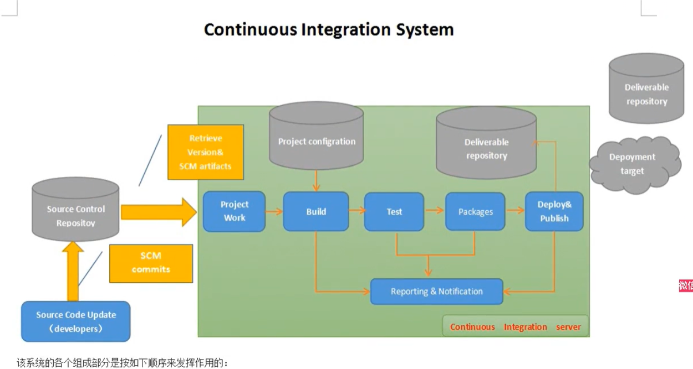
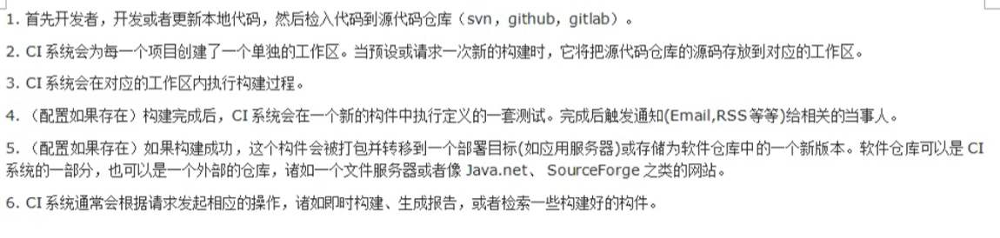

# 持续化集成
持续集成，CI（continuous integration）

持续集成，简单的说就是时刻监控变动，只要出现变动或者或者问题，第一时间通知相关人员

# jenkins
jenkins是一个开源软件项目，是基于java开发的一种持续集成工具，用户监控持续重复的工作，旨在提供一个开放易用的软件平台，使软件的持续集成变成可能
## jenkins安装
依赖java环境:查看jenkins官网 对jdk版本有相应的要求

1.下载jenkins.war

2.进入jenkins.war所在目录，执行;java –jar Jenkins.war --httpPort=8080（可写可不写）

3.浏览器进入：localhost：8080

4.输入初始的密码

5.下载插件

6.设置初始化的用户信息

7.公司环境一般都是装在服务器的
### windows下载jenkins
1.下载jdk：
配置环境变量JAVA_HOME:jdk安装目录；修改path:%JAVA_HOME%\bin,%JAVA_HOME%\jre\bin。
cmd验证：java -version

2.下载tomcat（可以不用）
下载解压。startup.bat
3.下载jenkins
### linux下载jenkins

## 更改jenkins的工作路径
可以在启动之前配置新的环境变量path：JENKINS_HOME；

## jenkins中3大重要概念
1.job（任务/工程）
在jenkins平台中，都是以job为单位去完成一件事的。在使用jenkins时，都是会在Jenkins管理界面当中创建一个job/item，在job/item中组织任务

2.plugin（插件）
jenkins提供平台，集成各种插件来完成一个job。想用jenkins来做什么，先找找有没有相应的插件

3.workspace（工作空间）
jenkins是通过文件形式来存储和管理数据的。所以，在安装jenkins，要指定一个jenkins_home目录。所有Jenkins相关的数据都存放在此目录下。

## 创建使用job应用
1.新建job

2.自定义工作空间

3.输入执行命令：python all.py

4.执行grovy脚本: System setProperty("hudson.model.DirectoryBroserSupport.CSP","")
（不会丢失html样式，但是jenkins重启就没有了）

## 配置git

Failed to connect to repository : Command "git.exe ls-remote -h -- https://github.com/sobermh/database_request_pytest.git HEAD" returned status code 128:
stdout:
stderr: fatal: unable to access 'https://github.com/sobermh/database_request_pytest.git/': OpenSSL SSL_read: Connection was reset, errno 10054

可能是：用户凭证不对，注意分支要一致。有的可能是main，有的是master。
## 集成Allure报告
1.安装allure插件 Allure Jenkins Plugin

2.在【全局工具配置】，配置allure

3.在job配置allure报告:注意！！！！json等文件生成的路径和最后报告查看的路径，不能一样。report路径最好不要变allure-report；result路径是生成json文件的路径。

## 展示html测试报告
1.安装插件  HTML Publisher

2.

## 企业微信实战
1.创建企业微信群管理机器人，获得webhook

2.安装插件：Qy Wechat......

3.在【系统配置】添加webhook地址

4.进入job，添加构建后的操作，配置企业微信通知

## 集成电子邮件通知
1.安装插件： extend Email...

2.新建一个邮箱：如163，打开POP3和smtp，获得客户端密码

3.在【系统配置】配置邮件的发件人（系统管理员）（只有一个发件人），SMTP服务器，收件人信息。（多个收件人用逗号隔开）

4.进入job，添加构建后操作，配置邮件通知

## 构建定时任务
构建触发器
Build periodically
日程表
* * * * * MINUTE HOUR DOM MONTH DOW
          0-59   0-23 1-31 1-12  0-7（0和7表示周天）
每天晚上20点
0 20 * * *

一周1，3，5晚上20点执行
0 20 * * 1,3,5

每周周一到周五晚上20点执行
0 20 * * 1-5

一周内每2天执行，20点执行一次
0 20 * * * /2

## 运行python脚本
Build-add构建步骤：

默认的路径在工作路径下。

